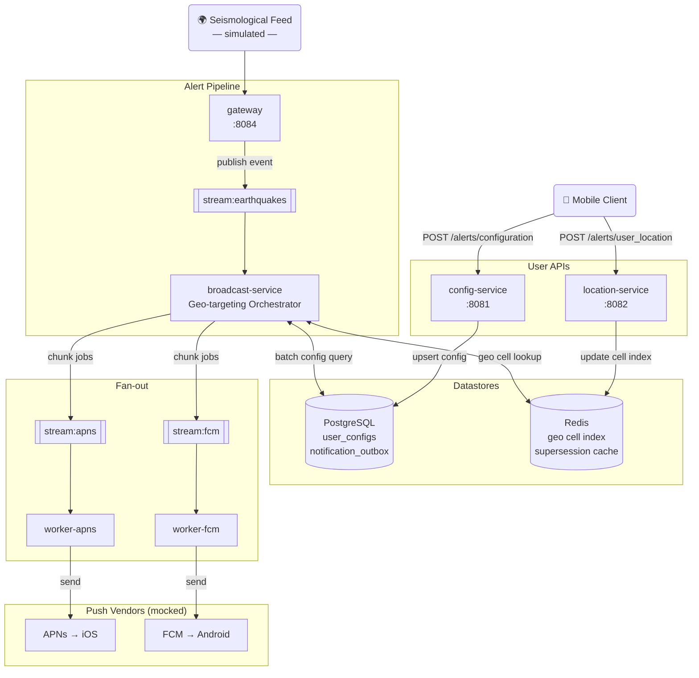
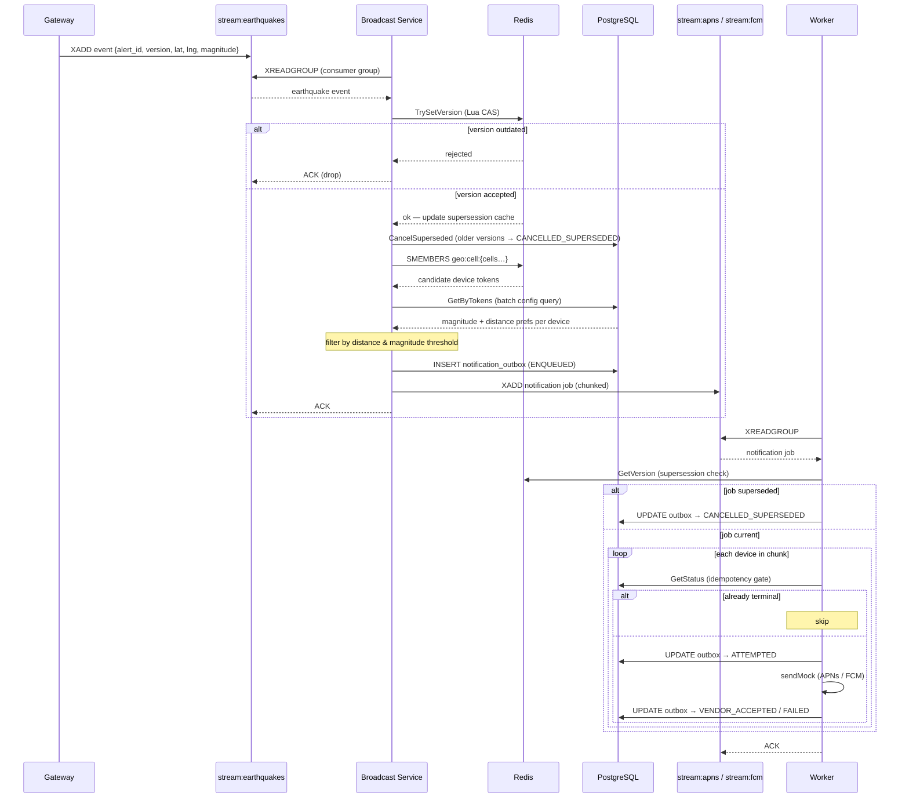
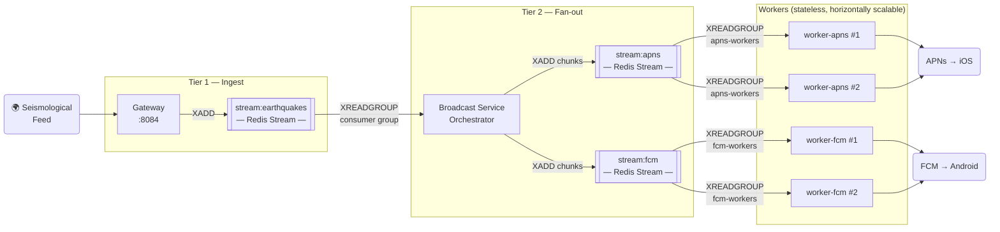

# Earthquake Notification System

A production-minded implementation of an earthquake early-warning notification system, based on the system design lecture *"Design an Earthquake Notification System"*.

The goal is to demonstrate the core architectural trade-offs discussed in the lecture — geo-indexing, fan-out via message queues, and duplicate-notification prevention — in runnable Go code.

---

## Architecture Overview

### System Diagram



### Alert Broadcast Sequence



### Services

| Service | Port | Responsibility |
|---|---|---|
| `config-service` | 8081 | Stores user alert preferences (magnitude threshold, distance, channel) |
| `location-service` | 8082 | Receives periodic device location updates; writes to geohash cell index |
| `gateway` | 8084 | Ingests earthquake events; publishes to `stream:earthquakes` |
| `broadcast-service` | — | Consumes events, runs geo-targeting, enqueues notification jobs |
| `worker` (×2) | — | Sends push notifications per channel (APNs / FCM) |

---

## Key Design Decisions

### 1. Geo-indexing with Geohash (cell-based location index)

> The lecture recommends **S2 or H3** for production because they offer native polygon coverage and equal-area cells. This project uses **geohash** (pure Go, no CGO) to keep the setup simple; the concepts are identical.

**Write path:** when a device reports its position, `location-service` converts `(lat, lng)` to a geohash cell string at precision 5 (≈ 4.9 km × 4.9 km) and stores it in Redis:

```
geo:cell:{geohash}          → SET of device tokens in this cell
geo:device:{token}:cells    → SET of cells currently occupied (for cleanup)
geo:device:{token}:loc      → "lat,lng"  (raw coords, TTL = 30 days)
```

**Read path (alert time):** `broadcast-service` computes all cells within the earthquake's estimated felt-radius using BFS over the geohash neighbor graph, then batches `SMEMBERS` calls in a single pipeline.

### 2. Two-tier queue decoupling (Redis Streams)



Two independent queue layers:

| Layer | Producer → Consumer | Why |
|---|---|---|
| **Tier 1** | Gateway → Broadcast Service | Decouples long-lived event-source connections from CPU-heavy geo-targeting. Gateway stays alive even if the orchestrator restarts. |
| **Tier 2** | Broadcast Service → Workers | Absorbs traffic spikes. Each channel scales independently — an APNs outage only stalls `stream:apns`; FCM delivery continues unaffected. |

**Why Redis Streams over Kafka?** Redis is memory-first with sub-millisecond enqueue latency. Kafka is disk-first, optimised for high-throughput durable logs — not the low-latency fan-out this use case needs.

### 3. Supersession (out-of-order alert handling)

When an alert is updated (e.g. magnitude revised upward), the gateway publishes a new message with the same `alert_id` but an incremented `version`.

A Redis Lua script atomically checks whether the incoming version is the latest:

```
supersession:{alert_id} → latest_version  (string, TTL = 24 h)
```

If a newer version already exists, the event is **dropped** by the broadcast service and any in-flight jobs are cancelled.

### 4. Notification Outbox (idempotency + deduplication)

Every device-level notification is recorded in PostgreSQL **before** it is enqueued:

```sql
notification_outbox (
  notification_id VARCHAR(64) PRIMARY KEY,   -- SHA-256(alert_id|version|device_id)
  alert_id, version, device_id, channel,
  status  -- ENQUEUED | ATTEMPTED | VENDOR_ACCEPTED | FAILED | CANCELLED_SUPERSEDED
)
```

Workers check the outbox before every send:

- **Terminal status found** → skip (idempotency gate).
- **Not found / ENQUEUED** → mark `ATTEMPTED`, send, then mark `VENDOR_ACCEPTED` or `FAILED`.

This makes at-least-once queue delivery safe: re-delivered jobs are detected and skipped without re-sending.

---

## Project Structure

```
.
├── cmd/
│   ├── config-service/      # REST API: user alert preferences
│   ├── location-service/    # REST API: device location updates
│   ├── gateway/             # Earthquake event ingestion + HTTP trigger
│   ├── broadcast-service/   # Geo-targeting orchestrator
│   ├── worker/              # Push notification sender (APNs / FCM)
│   └── tokengen/            # Dev helper: mint JWT tokens
├── internal/
│   ├── domain/              # Shared domain models & constants
│   ├── geo/                 # Geohash cell utilities (BFS radius, haversine)
│   ├── auth/                # JWT middleware
│   ├── db/                  # PostgreSQL: config repo, outbox repo
│   ├── cache/               # Redis: location index, supersession cache
│   └── queue/               # Redis Streams: producer & consumer
├── migrations/
│   └── 001_init.sql         # Schema for user_configs + notification_outbox
├── Dockerfile               # Multi-stage build (ARG SERVICE selects binary)
├── docker-compose.yml       # Full local stack
└── Makefile                 # Dev workflow shortcuts
```

---

## Quick Start

### Prerequisites

- [Docker](https://docs.docker.com/get-docker/) + Docker Compose
- Go 1.22+ (only needed for local development / tokengen)

### 1. Start the full stack

```bash
make up
```

This builds all service images and starts PostgreSQL, Redis, and all application services.

### 2. Fetch Go dependencies (first time only)

```bash
make deps
```

### 3. Seed test devices

Registers 3 fake devices with different locations and alert preferences:

```bash
make seed
```

Devices seeded:

| Token | Location | Min. Magnitude | Max. Distance | Channel |
|---|---|---|---|---|
| `apns_device_001` | Taipei (25.03, 121.57) | M 4.0 | 200 km | APNs |
| `fcm_device_001` | Taichung (24.15, 120.67) | M 5.0 | 150 km | FCM |
| `fcm_device_002` | Kaohsiung (22.63, 120.30) | M 3.5 | 300 km | FCM |

### 4. Trigger a synthetic earthquake

```bash
make quake          # M6.5 near Taipei
```

Watch the broadcast-service and worker logs:

```bash
make logs
```

Expected output (broadcast-service):

```
broadcast-service: alert_id=3f7a8b… mag=6.5 radius=500km cells=12834
broadcast-service: alert_id=3f7a8b… matched=2 (apns=1 fcm=1)
```

Expected output (worker-apns / worker-fcm):

```
  [APNS] → device=apns_device_… mag=6.5 lat=25.0330 long=121.5654
  [FCM]  → device=fcm_device_0… mag=6.5 lat=25.0330 long=121.5654
```

### 5. Toggle random earthquake simulation

```bash
make simulate   # start
make simulate   # stop
```

---

## Manual API Usage

### Generate a JWT

```bash
go run ./cmd/tokengen -token my-device-001
# or: make token DEVICE=my-device-001
```

### Set alert configuration

```bash
curl -X POST http://localhost:8081/alerts/configuration \
  -H "Authorization: Bearer <token>" \
  -H "Content-Type: application/json" \
  -d '{"magnitude": 4.5, "distance_km": 250, "channel": "fcm"}'
```

### Report device location

```bash
curl -X POST http://localhost:8082/alerts/user_location \
  -H "Authorization: Bearer <token>" \
  -H "Content-Type: application/json" \
  -d '{"lat": 25.0330, "long": 121.5654}'
```

### Trigger an earthquake (with version update example)

```bash
# Initial event
curl -X POST http://localhost:8084/earthquake \
  -H "Content-Type: application/json" \
  -d '{"alert_id":"quake-001","version":1,"lat":25.03,"long":121.56,"magnitude":5.0,"depth_km":15}'

# Revised magnitude — supersedes version 1
curl -X POST http://localhost:8084/earthquake \
  -H "Content-Type: application/json" \
  -d '{"alert_id":"quake-001","version":2,"lat":25.03,"long":121.56,"magnitude":6.2,"depth_km":15}'
```

---

## Scalability Notes

| Concern | This implementation | Production recommendation |
|---|---|---|
| Geo index | Geohash precision 5 (pure Go) | H3 (Uber) or S2 (Google) for equal-area cells and native polygon coverage |
| Location writes | Redis SADD + SET | Same; target ≈5.5K writes/s for 20M users at 1 update/hour |
| Queue | Redis Streams (memory-first) | Redis Streams or Kafka depending on durability requirements |
| Workers | Single process per channel | Scale horizontally; all workers share the same consumer group |
| Config lookup | PostgreSQL batch query | Add a Redis cache layer for hot devices |
| Deduplication | SHA-256 notification_id + PostgreSQL | Same pattern; partition outbox table by alert_id for large scale |

---

## Running Tests

```bash
go test ./...
```

> Unit tests focus on the geo utilities (`internal/geo`) and domain logic.
> Integration tests require a live PostgreSQL + Redis (use `make up` first).

---

## Tech Stack

| Component | Technology |
|---|---|
| Language | Go 1.22 |
| HTTP server | `net/http` (stdlib, Go 1.22 method routing) |
| Database | PostgreSQL 16 |
| Cache / Queue | Redis 7 (Streams, Sets, Lua scripting) |
| Geo indexing | `github.com/mmcloughlin/geohash` |
| Authentication | HS256 JWT (`github.com/golang-jwt/jwt/v5`) |
| Containerisation | Docker + Docker Compose |

---

## Updating the Module Path

The Go module is currently named `earthquake-notification-system`. If you fork this repository, update the module path in `go.mod` and all import statements:

```bash
# macOS / Linux
find . -type f -name '*.go' | xargs sed -i '' \
  's|earthquake-notification-system|github.com/YOUR_USERNAME/earthquake-notification-system|g'
# Update go.mod first line too
sed -i '' 's|^module .*|module github.com/YOUR_USERNAME/earthquake-notification-system|' go.mod
```

---

## References

- Lecture: *Design an Earthquake Notification System* — buildmoat.org
- [H3 Geo Index](https://h3geo.org/) — Uber's hexagonal spatial index
- [Google S2 Geometry](https://s2geometry.io/) — alternative spatial index used by Pokémon Go, Foursquare
- [Redis Streams](https://redis.io/docs/data-types/streams/) — at-least-once message delivery
- [Transactional Outbox Pattern](https://microservices.io/patterns/data/transactional-outbox.html)
